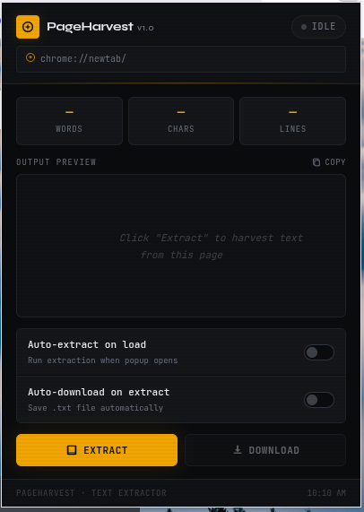
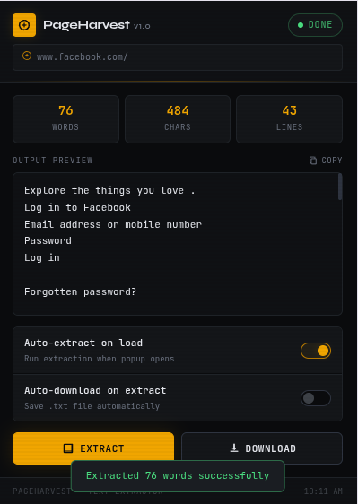

<div align="center">

```
██████╗  █████╗  ██████╗ ███████╗██╗  ██╗ █████╗ ██████╗ ██╗   ██╗███████╗███████╗████████╗
██╔══██╗██╔══██╗██╔════╝ ██╔════╝██║  ██║██╔══██╗██╔══██╗██║   ██║██╔════╝██╔════╝╚══██╔══╝
██████╔╝███████║██║  ███╗█████╗  ███████║███████║██████╔╝██║   ██║█████╗  ███████╗   ██║   
██╔═══╝ ██╔══██║██║   ██║██╔══╝  ██╔══██║██╔══██║██╔══██╗╚██╗ ██╔╝██╔══╝  ╚════██║   ██║   
██║     ██║  ██║╚██████╔╝███████╗██║  ██║██║  ██║██║  ██║ ╚████╔╝ ███████╗███████║   ██║   
╚═╝     ╚═╝  ╚═╝ ╚═════╝ ╚══════╝╚═╝  ╚═╝╚═╝  ╚═╝╚═╝  ╚═╝  ╚═══╝  ╚══════╝╚══════╝   ╚═╝   
```

**Extract. Preview. Download.**  
A production-grade Chrome Extension for harvesting visible text from any webpage.

[](https://developer.chrome.com/docs/extensions/mv3/)
[]()
</div>

---

## 📖 Table of Contents

- [Overview](#-overview)
- [Features](#-features)
- [Screenshots](#-screenshots)
- [Installation](#-installation)
  - [Install from Source (Developer Mode)](#install-from-source-developer-mode)
- [How It Works](#-how-it-works)
- [Extension Structure](#-extension-structure)
- [Permissions Explained](#-permissions-explained)
- [Technical Architecture](#-technical-architecture)
- [Use Cases](#-use-cases)
- [Error Handling](#-error-handling)
- [Known Limitations](#-known-limitations)
- [Contributing](#-contributing)
- [License](#-license)

---

## 🔍 Overview

**PageHarvest** is a Chrome Extension built with Manifest V3 that extracts all visible, human-readable text from any webpage and lets you download it as a clean `.txt` file. It ignores scripts, styles, hidden elements, and markup noise — giving you only the content that matters.

Built for **security researchers**, **data analysts**, **journalists**, and **power users** who need fast, reliable text extraction without copy-paste fatigue.

---

## ✨ Features

| Feature | Description |
|---|---|
| 🌾 **Smart Extraction** | Recursively harvests all visible DOM text using a `TreeWalker`-based engine |
| 👁️ **Live Preview** | Scrollable text preview inside the popup before downloading |
| 💾 **One-Click Download** | Saves a `.txt` file with metadata header (URL, title, timestamp, word count) |
| ⚡ **Auto-Extract on Open** | Optionally run extraction the moment you open the popup |
| 📥 **Auto-Download on Extract** | Optionally save the file automatically after extraction completes |
| 📋 **Copy to Clipboard** | Copy extracted text directly without downloading |
| 📊 **Live Stats** | Real-time word count, character count, and line count |
| 🧹 **Clean Output** | Removes duplicate whitespace, empty lines, and formatting noise |
| 🔒 **Privacy First** | No data leaves your browser. Zero external network calls. |
| 🌙 **Dark Mode UI** | Industrial amber-on-black terminal aesthetic |
| 💾 **Persistent Settings** | Toggle preferences saved via `chrome.storage.local` |

---

## 📸 Screenshots

> _Add your own screenshots here after loading the extension._

| Popup — Idle State | Popup — Extracted |
|---|---|
 |  |

---

## 🚀 Installation

### Install from Source (Developer Mode)

> No Chrome Web Store listing yet. Install manually in under a minute.

**Step 1 — Clone the repository**

```bash
git clone https://github.com/YOUR_USERNAME/pageharvest-extension.git
cd pageharvest-extension
```

**Step 2 — Open Chrome Extensions page**

Navigate to:
```
chrome://extensions/
```

**Step 3 — Enable Developer Mode**

Toggle **Developer Mode** on (top-right corner of the page).

**Step 4 — Load the extension**

Click **"Load unpacked"** and select the root folder of this repository (the folder containing `manifest.json`).

**Step 5 — Pin it**

Click the puzzle icon in Chrome's toolbar → pin **PageHarvest**.

**Step 6 — Use it**

Navigate to any webpage, click the PageHarvest icon, and hit **Extract**.

---

## ⚙️ How It Works

1. **User clicks Extract** in the popup.
2. `popup.js` calls `chrome.scripting.executeScript()` to inject a self-contained extraction function into the active tab.
3. The injected function uses a **`TreeWalker`** to traverse the live DOM:
   - Skips `SCRIPT`, `STYLE`, `NOSCRIPT`, `IFRAME`, `SVG`, `CANVAS`, and other non-content tags.
   - Skips elements hidden via `display: none`, `visibility: hidden`, `opacity: 0`, `aria-hidden="true"`, or zero bounding-box size.
   - Inserts newlines around block-level elements (`<p>`, `<div>`, `<h1>–<h6>`, `<li>`, etc.) to preserve document structure.
4. The raw text is **cleaned**: collapsing whitespace, trimming blank lines (max 2 consecutive), normalizing line endings.
5. The result is sent back to `popup.js`, which renders a **preview** (first 4,000 chars) and updates stats.
6. On **Download**, `popup.js` sends a message to `background.js` (the service worker), which calls `chrome.downloads.download()` with a `data:text/plain` URL.
7. The saved `.txt` file includes a structured **metadata header** at the top.

### Output File Format

```
═══════════════════════════════════════════════════════
  PageHarvest — Extracted Text
═══════════════════════════════════════════════════════
  Source  : https://example.com/article
  Title   : Example Article Title
  Extracted: 2026-03-24T16:07:42.000Z
  Words   : 2.4K
  Chars   : 14.1K
═══════════════════════════════════════════════════════

[text text]
```

---

## 📁 Extension Structure

```
pageharvest-extension/
│
├── manifest.json        # Manifest V3 configuration
├── popup.html           # Extension popup UI markup
├── popup.css            # Dark mode styling (JetBrains Mono + Syne)
├── popup.js             # UI controller — state, events, extraction orchestration
├── content.js           # Standalone DOM harvester (reference / documented version)
├── background.js        # Service worker — download handler, tab update listener
│
├── icons/
│   ├── icon16.png       # Toolbar icon (16×16)
│   ├── icon32.png       # Toolbar icon (32×32)
│   ├── icon48.png       # Extensions page icon (48×48)
│   └── icon128.png      # Chrome Web Store icon (128×128)
│
└── README.md
```

> **Note:** The extraction logic is self-contained inside `popup.js` (as an inline function passed to `executeScript`). `content.js` is the annotated reference version of the same logic.

---

## 🔐 Permissions Explained

| Permission | Why It's Needed |
|---|---|
| `activeTab` | Read the URL and title of the currently focused tab |
| `scripting` | Inject the extraction function into the active tab's page context |
| `downloads` | Trigger the `.txt` file download via Chrome's download API |
| `storage` | Persist user toggle preferences (auto-extract, auto-download) across sessions |
| `host_permissions: <all_urls>` | Allow script injection on any website the user is visiting |

**Privacy guarantee:** PageHarvest makes zero external network requests. All processing happens locally in your browser. No data is sent anywhere.

---

## 🧠 Technical Architecture

### Manifest V3 Compliance

- Uses **`chrome.scripting.executeScript`** instead of deprecated `chrome.tabs.executeScript`
- Background runs as a **service worker** (not a persistent background page)
- No use of `eval()` or remote code execution
- CSP-compliant — all scripts are bundled locally

### DOM Traversal Engine

```
TreeWalker
  ├── SHOW_ELEMENT  →  filter hidden / skip-tag elements
  └── SHOW_TEXT     →  collect non-empty text nodes

Post-processing pipeline:
  raw text
    → collapse horizontal whitespace
    → trim line-leading/trailing spaces  
    → cap consecutive newlines to 2
    → trim overall
```

### State Machine (popup.js)

```
idle  ──[Extract clicked]──▶  extracting  ──[success]──▶  done
                                           └──[failure]──▶  error
```

### Message Passing

```
popup.js  ──{ action: "downloadText", payload: { text, filename } }──▶  background.js
                                                                              │
                                                                    chrome.downloads.download()
                                                                              │
          ◀──{ success: true, downloadId }────────────────────────────────────┘
```

---

## 💼 Use Cases

- **Security Research** — Quickly extract page text for keyword/pattern analysis
- **OSINT** — Harvest content from web pages without manual copy-paste
- **Journalism** — Archive article text with source URL and timestamp
- **Content Analysis** — Feed extracted text into NLP tools or LLMs
- **Accessibility Auditing** — See what text a page exposes to screen readers
- **Data Collection** — Batch-extract content during manual web research sessions
- **Academic Research** — Save article text with provenance metadata intact

---

## 🐞 Error Handling

| Scenario | Behavior |
|---|---|
| Chrome internal page (`chrome://`) | Blocked with user-friendly error message |
| Page with script injection restrictions | CSP/permission error surfaced in UI |
| Page with no visible text | "No visible text found" notification |
| Download API failure | Toast error with specific message |
| Clipboard API denied | Toast error fallback |
| Script returns null | Graceful error with explanation |

All errors are displayed **in-popup** — no silent failures, no browser console spam.

---

## ⚠️ Known Limitations

- **Cannot extract from `chrome://` pages** — This is a Chrome security restriction that cannot be bypassed.
- **Cannot extract from Chrome Web Store pages** — Chrome blocks extension script injection on its own store.
- **Some SPAs may need a manual re-extract** — If the page updates content via JavaScript after load, click Extract again to re-harvest.
- **Preview is capped at 4,000 characters** — The full text is always saved to the download file without truncation.
- **PDFs opened in Chrome's built-in viewer** — Text extraction may be incomplete depending on the PDF's structure.
- **iframes** — Content inside cross-origin `<iframe>` elements is excluded (browser security boundary).

---

<div align="center">

**Star ⭐ the repo if PageHarvest saves you time.**

</div>
